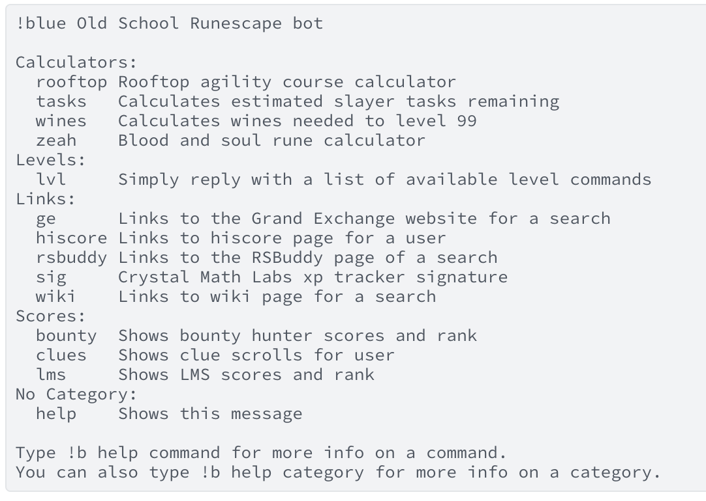
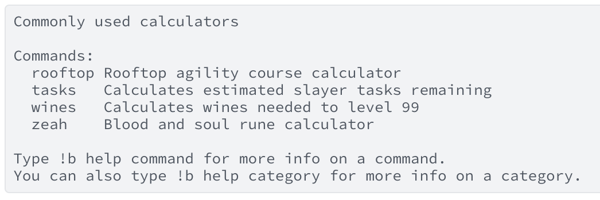
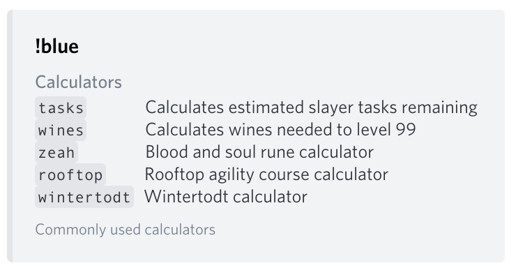
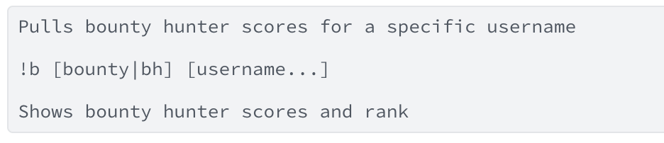
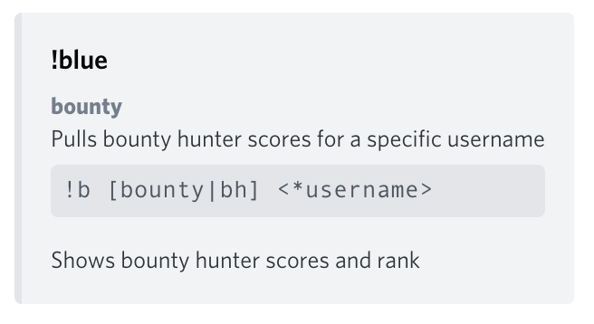

# Embed_help

A rewritten help command for the [discord.py](https://discordpy.readthedocs.io/en/latest/) python library

* [Usage](#usage)
  * [How to use if your bot already has cogs](#how-to-use-if-your-bot-already-has-cogs)
  * [How to add to your bot if it doesn't have cogs](#how-to-add-to-your-bot-if-it-doesnt-have-cogs)
* [Screenshots](#screenshots)

## Usage

### How to use if your bot already has cogs
Clone into your cogs folder
```
git clone https://github.com/zedchance/embed_help.git
```

Add `cogs.embed_help.help` to your cogs array and disable the built in help message like this:
```py
bot.remove_command('help')
cogs = [ ..., 'cogs.embed_help.help']
```

### How to add to your bot if it doesn't have cogs
Create a directory called `cogs` in your project and clone
```
git clone https://github.com/zedchance/embed_help.git
```

Add the command to disable the built in help message and create a list called `cogs` like this:
```py
bot.remove_command('help')
cogs = ['cogs.embed_help.help']
```

Then in your `on_ready` method load the cogs:
```py
@bot.event
async def on_ready():
    # Your existing stuff
    for cog in cogs:
        bot.load_extension(cog)
```

## Screenshots

Here are some examples of what the help messages look like before and after.

The default help message before:  


Default help message after:  


The help message on a category before:  


And after:  


The help command on a command before:  


And after:  

